# 1. 基本介绍
## 1.1 模型结构
ForeSim支持多种仿真对象的建模，以下是对象的结构树。

## 1.2 平台介绍
### 1.2.1 平台主界面
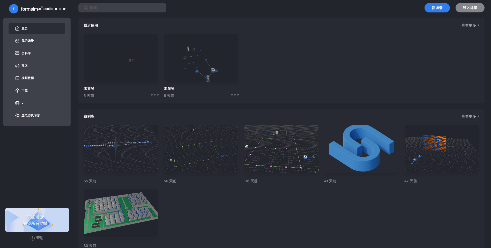
1. 新场景: 新建一个ForeSim仿真场景，会另起一个页面并打开ForeSim编辑器。
2. 导入场景：导入一个已有的ForeSim仿真场景，会另起一个页面并打开ForeSim编辑器。
3. 我的场景：查看在平台「与我相关」的仿真场景。
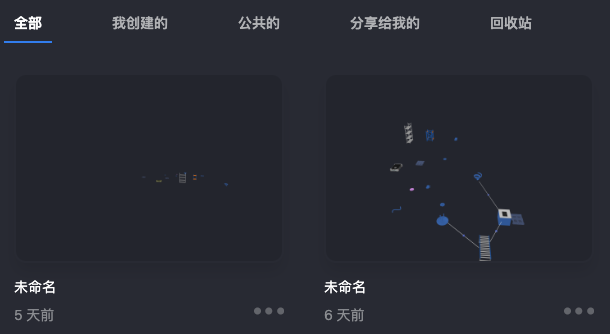
4. 资料库: 分为案例库、模型库、AI建模库。
* 可以参考已有的案例库来辅助场景建模；
* 模型库主要用来自定义场景中仿真模型的个性化展示，以及自定义仿真模型；
* 可以使用AI建模工具更加定制化的生成仿真模型的3D对象。

### 1.2.2 平台编辑器页面
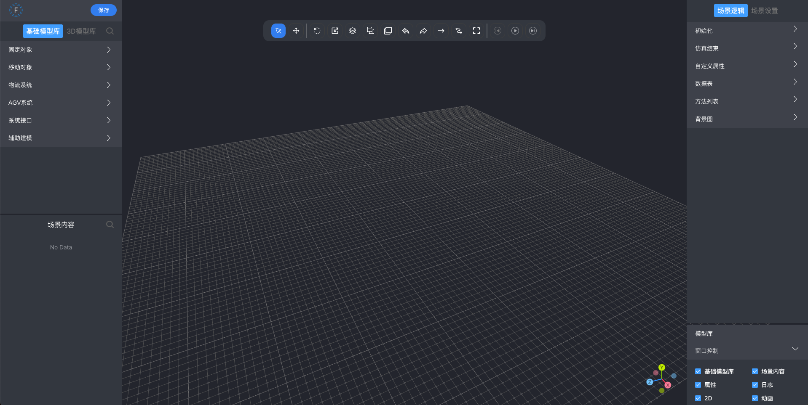
// todo编辑器功能与描述

# 2. 仿真建模

## 2.1 属性
仿真对象的属性主要分为6类，这里首先解释所有或部分对象都有的通用属性。
1. 模型属性: 对象的空间建模属性，用于标识对象以及指定对象在场景中的位置及方向。

    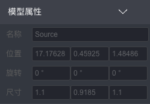

   - 名称 Name（String）：对象在场景中的唯一标识，不可重复。
   - 位置 Position（Struct）：对象在场景中的坐标。
   - 旋转 Angle（Struct）：对象在场景中的欧拉角度。
   - 尺寸 Size（Struct）：对象X/Y/Z方向上的缩放。 
   - 模型 modelSwitch（ModelInputSelect）：可以切换，用于指定对象的3D模型。
   
    => 

2. 基础属性: 对象的基本属性。
   
    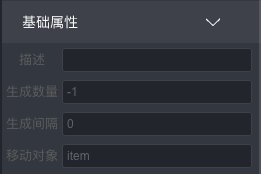

   - 描述 Description（String）：对象的描述。

3. 故障特性: 对象的故障特性，用于指定对象的故障发生行为的特征。

    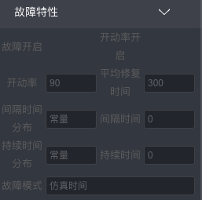
    - 故障开启 FailureActive（Boolean）：是否开启故障。
    - 开动率开启 AvailabilityActive（Boolean）：开动率是否开启。
    - 开动率 Availability（Real）：故障开动率。 
    - 平均修复时间 MTTR（Time）：平均修复时间。 
    - 间隔时间分布 FailureIntervalDist（String）：取值：常量、指数分布、均匀分布、Gamma分布、爱尔朗分布。 
    - 间隔时间 FailureIntervalDistValue（Time)。
    - 持续时间分布 FailureRepairDist（String）：取值：常量、指数分布、均匀分布、Gamma分布、爱尔朗分布。 
    - 持续时间 FailureRepairDistValue（Time）。 
    - 故障模式 FailureMode（String）：取值：仿真时间、工作时间。

4. 统计: 对象的仿真统计结果，只读属性，用于在仿真时查看模型的运行情况。

   在介绍统计指标之前需要先介绍一下对象有哪些状态：

       1）等待状态（Waiting），待机，等待零件进入；
       2）工作状态（Working），零件正在加工，此时其他零件无法进入；
       3）阻塞状态（Blocked），零件加工完成，但未离开；
       4）故障状态（Failed），设备待机或工作时，发生故障，需要维修。

   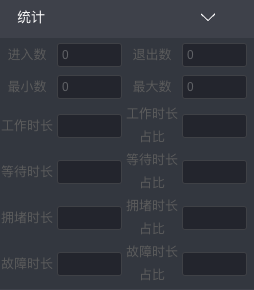

    - 进入数 MetricsInCount（Integer）：模型进入移动对象（MU）的数量。 
    - 退出数 MetricsOutCount（Integer）。 
    - 最小数 MetricsMinCount（Integer）。	 
    - 最大数 MetricsMaxCount（Integer）。	
    - 工作时长 MetricsWorkTime（time）。 
    - 工作时长占比 MetricsWorkPercent（float）。 
    - 等待时长 MetricsWaitTime（time）。 
    - 等待时长占比 MetricsWaitPercent（float）。 
    - 拥堵时长 MetricsBlockTime（time）。 
    - 拥堵时长占比 MetricsBlockPercent（float）。 
    - 故障时长 MetricsFailTime（time）。 
    - 故障时长占比 MetricsFailPercent（float）。

5. 基础逻辑:

    

    - 入口控制 InCtrl（Script）：仿真对象的入口控制逻辑，移动对象进入该对象时自动调用的控制方法。
    - 入口前/后控制 InCtrlFront/InCtrlRear（Boolean）：指定入口控制的执行时机。
    - 出口控制 InCtrl（Script）：仿真对象的入口控制逻辑，移动对象离开该对象时自动调用的控制方法。
    - 出口前/后控制 OutCtrlFront/OutCtrlRear（Boolean）：指定出口控制的执行时机。
    - 强制模式 OutStrategyBlocking（Boolean）：出口是否阻塞。（非强制模式下，会自动寻找出口；强制模式下，会等待上一个出口。）
    - 出口策略 OutStrategy（String）：出口策略, 取值: 循环/指定。

6. 自定义: 自定义属性。

## 2.2 固定对象
在仿真场景中不会移动的对象。

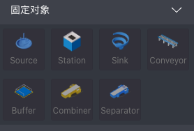

### 2.2.1 Source 
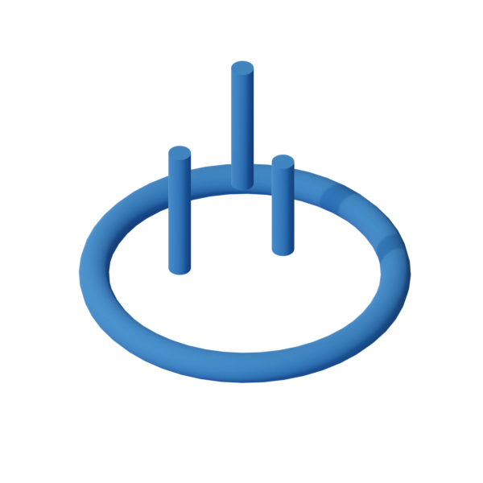

基本的仿真对象之一，所有需要进行仿真的移动对象（MU）都从这里产生，启动仿真后，会根据所定义的属性，自行按要求生产对象。
#### 基础属性
- 生成数量 Quantity（int）： 指定该Source总共生产多少对象。-1表示生产无限个。
- 生成间隔 CreateInterval（long）：指定该Source生产对象的间隔，单位是秒。间隔为0表示只要下游可以接收对象，便会直接生产一个对象。
- 移动对象 ItemPath（String）：指定该Source生产的对象是什么。（注意：场景中必须存在该对象。）

### 2.2.2 Station 

基本的仿真对象之一，用于加工MU的加工单元，一般需要一定的时间来加工零件。
#### 基础属性
- 加工时间 ProcTime（double）：指定该Station加工对象所需要花费的时间。

### 2.2.3 Sink 

基本的仿真对象之一，零件进入该对象后，标识零件已经生产完成。
#### 基础属性
- 节拍 ProcTime（double）：指定该Sink销毁对象所需要花费的时间。
#### 统计 
- 平均生命周期 MetricsAvgLifeSpan（float）：平均生命周期 = 结束时间 - 生成时间。
- 平均退出间隔 MetricsAvgExitInterval（float）：平均退出间隔 = 到达sink的时间间隔取平均。
- 总产出 MetricsTotalOutput（double）：总产出: 该对象已删除的数量。
- 每日产出 MetricsOutputPerDay（double）。
- 每小时产出 MetricsOutputPerHour（int）。

以上我们已经介绍过Source、Station、Sink对象了，可以做一个简单场景了。

首先拖入一个移动对象中的Item放入场景作为Source的引用，将其命名为「Item」；
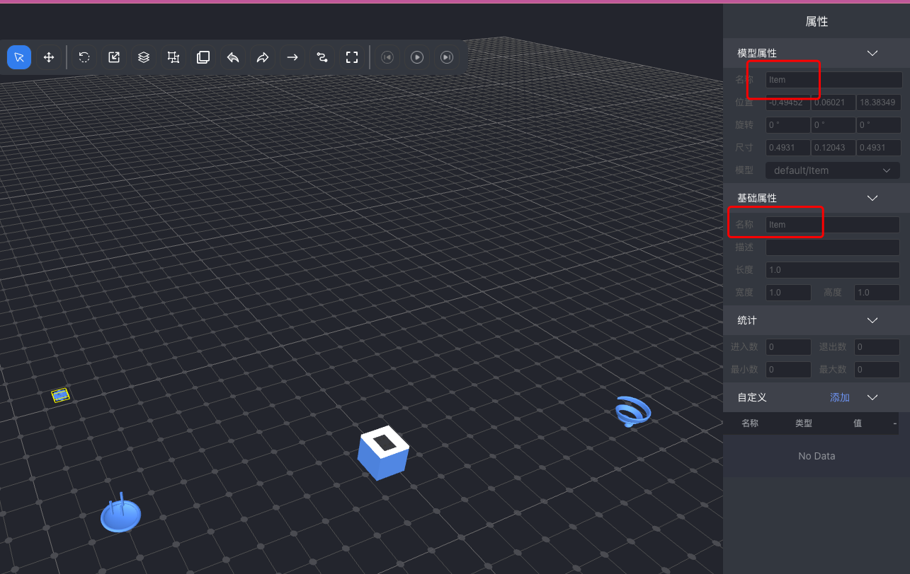
并拖一个Source放入场景中，把生成间隔设置成30，把属性「移动对象」设定为刚才拖入的Item的 名称，这里我们设置为「Item」；
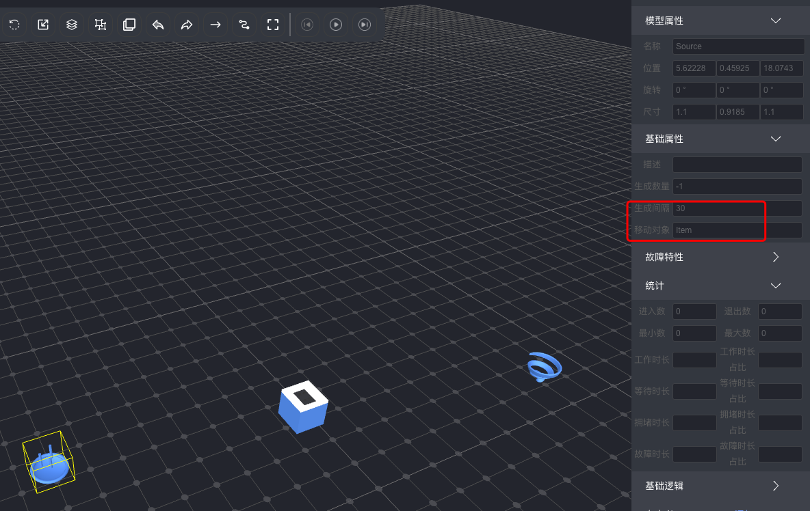
然后拖入一个Station放入场景将「加工时间」也设置为30，同上拖入一个Sink，节拍可以也设置为30；
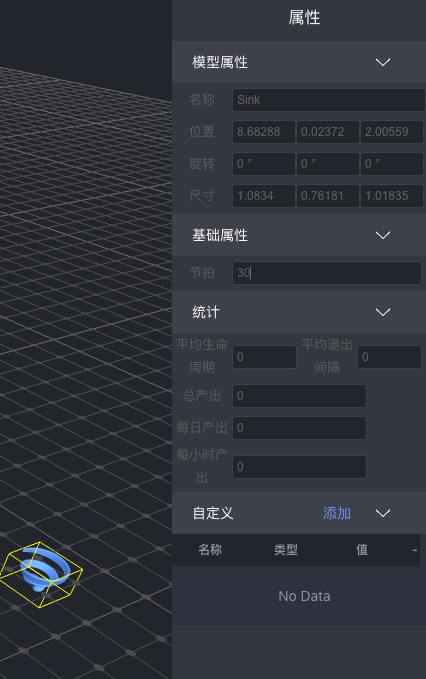
最后用单向连接把Source、Station、Sink依次连接起来；
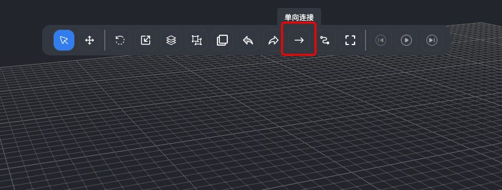

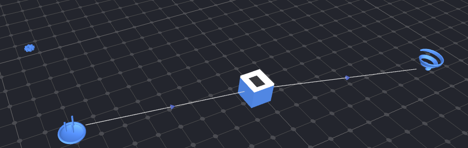
这样，我们的简单仿真场景就搭建好了，点击上方的启动按钮试一试吧！
过一会儿，我们就可以看到场景中会产生更多的Item了，并且Source、Station以及Sink的统计属性里面也有值了。

### 2.2.4 Conveyor 
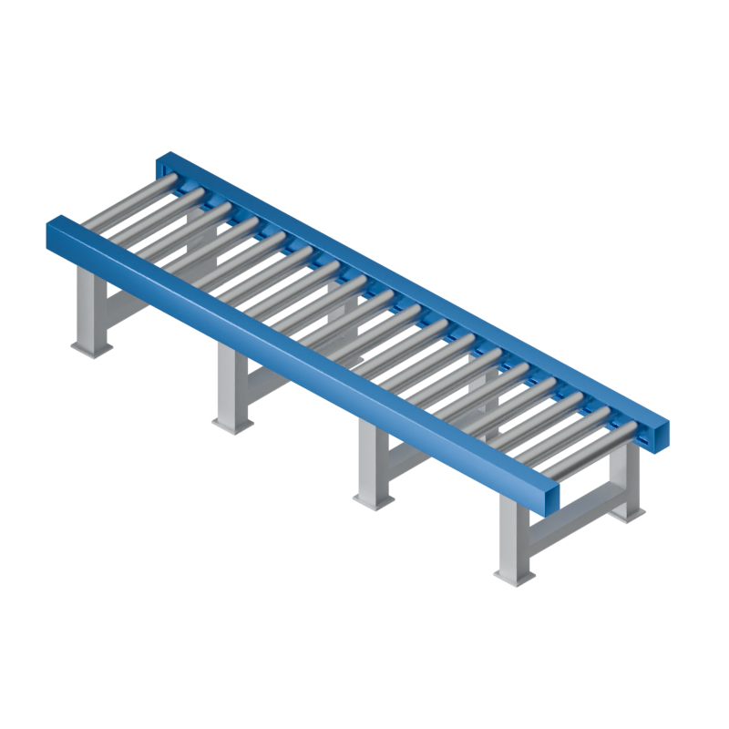

输送线，用于将零件（MU）从一个位置移动到另一个位置。
#### 基础属性
- 长度 Length（double）：输送线的长度。
- 宽度 Width（double）：输送线的宽度。
- 高度 Height（double）：输送线的高度。
- 容量 Capacity（int）：输送线的容量，最多同时有多少移动对象在输送线上。
- 速度 Speed（double）：移动对象在输送线上的移动速度。
- 可累积 IsAccumulating（boolean）：是否可累积，拥堵时累积。
- 反向运动 IsOpposite（boolean）：指定输送线的输送方向。

### 2.2.5 Buffer 
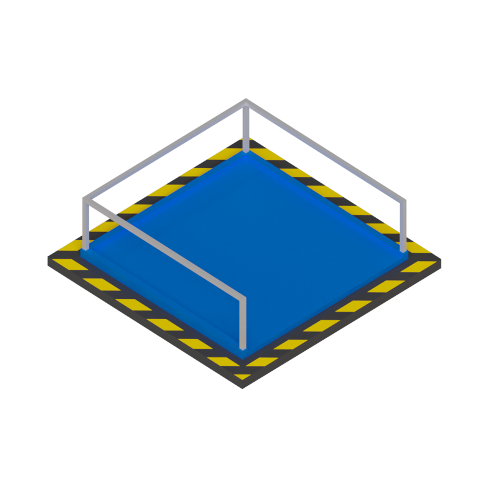

用于暂存已加工或待加工的零件，可以避免发生阻塞。
#### 基础属性
- 名称 Name（String）。
- 描述 Description（String）。
- 容量 Capacity（long）：暂存区的容量。
- 加工时间 StayTime（double）。
- 缓存类型 Type（String）：缓存策略，1，先进先出，2，后进先出。

## 2.3 移动对象
仿真场景中动态流动的对象。

### 2.3.1 Carrier 

用于携带零件一起移动。
#### 基础属性
- 容量 Capacity（int）：Carrier最多携带多少移动对象。
- 长度 Length（double）。
- 速度(m/s) Speed（double）：Carrier的移动速度。
- 加速度(m/s2) Acceleration（double）：Carrier的加速度。
- 减速度(m/s2) Deceleration（double）：Carrier的减速度。
- 开启电池 ChargeOpened（boolean）：电池功能开启开关，即Carrier是否使用电池管理。
- 当前电量 CurrentCharge（float）：即小车的初始电量。
- 电池容量(A) ChargeCapacity（integer）：小车的最大电量。
- 充电阈值(A) ChargeThreshold（real）：充电阈值，低于此阈值触发充电。
- 充电速度(A/s) ChargeSpeed（double）：充电速度，A/H，多少安每小时。
#### 统计
- 移动对象数 NumItem（long）：Carrier总共搬运了多少移动对象。
#### 基础逻辑
- 到达控制 DestReachedCtrl（Script）：小车到达后出发的脚本。
- 碰撞控制 CrashingCtrl（Script）：小车的碰撞控制脚本。
- 路径控制 RouteCtrl（Script）：小车的路径控制脚本。

### 2.3.2 Container 
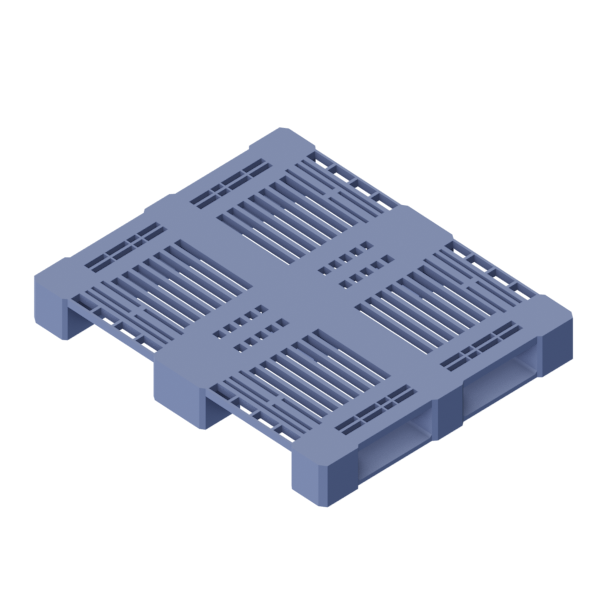

一般作为其他的容器，本身不会移动，需要放在小车或是其他对象上。常作为仓库中经常使用的托盘或料箱。
#### 基础属性
- 容量 Capacity（int）：容器最多装几个零件。
- 长度m Length（double）：容器的长度，单位m。
- 宽度m Width（double）：容器的宽度，单位m。
- 高度m Height（double）：容器的高度，单位m。
#### 统计
- 移动对象数 NumItem（long）：容器中一共装载过多少对象。

### 2.3.3 Item 

实体对象，无动力，一般用于指代被加工对象，例如原材料、零部件等。
#### 基础属性
- 长度 Length（double）。
- 宽度 Width（double）。
- 高度 Height（double）。

## 2.4 物流系统
这些对象主要用于移动/储存对象。

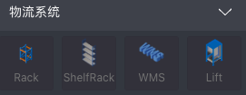

### 2.4.1 Rack 
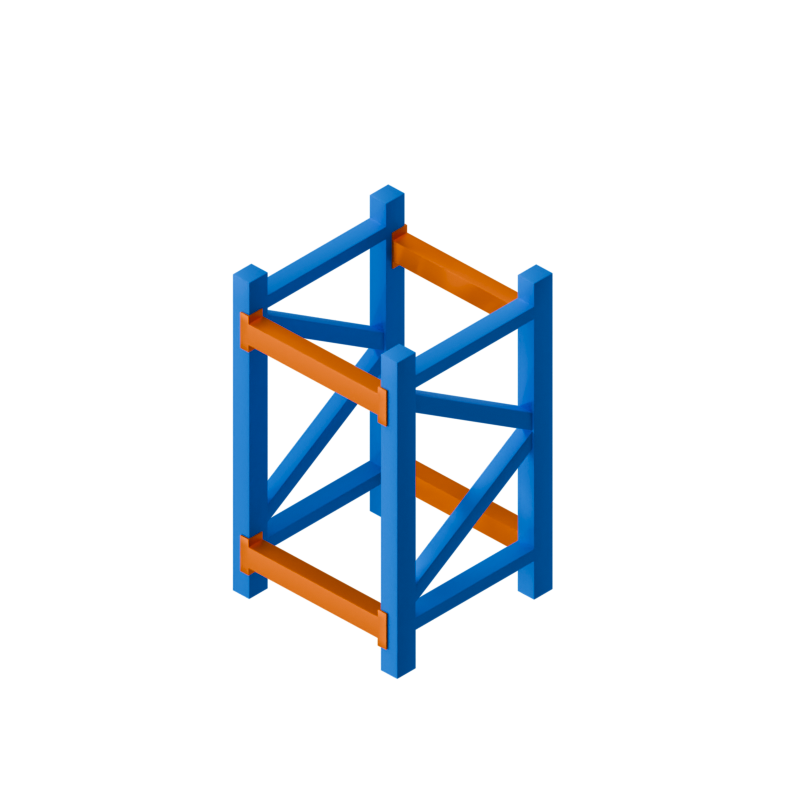

货架，用于存储移动对象。可参数化建模，通过货架的列数、层数、进深生成货架的大小形状。

#### 基础属性
- 列数 Column（double）。
- 列宽度 ColumnWidth（double）。
- 层数 Layer（double）。
- 层高度 LayerHeight（double）。
- 进深数 Depth（double）。
- 进深长 DepthLength（double）。
- 三维竖梁 ThreeD_VertBeamThick（double）。三维竖梁厚度，单位米
- 三维横梁 ThreeD_HorizBeamThick（double）。三维横梁厚度，单位米
- 离地间隙 ThreeD_GroundAbove（double）。离地间隙

参数化建模：
把列数改成2，会发现现在该货架在X方向上多了一格货架。

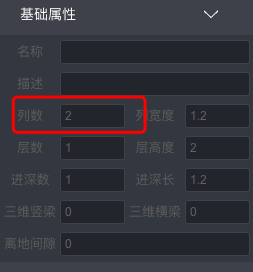
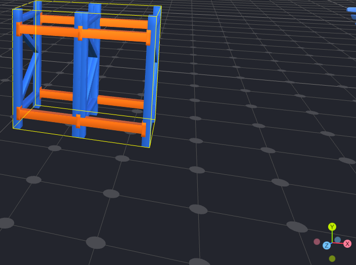

我们把层数和进深都改成了2，就会发现我们得到了一格2x2x2即8个储位的货架。
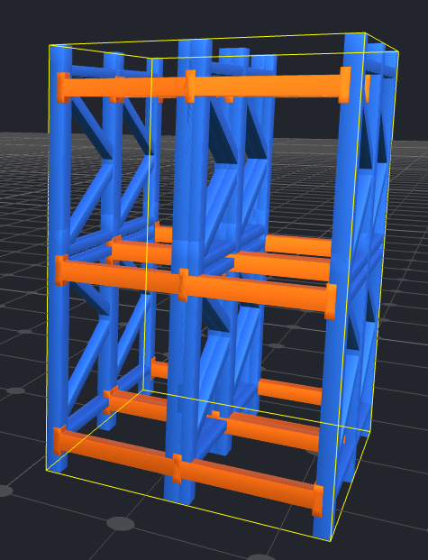

### 2.4.2 ShelfRack 
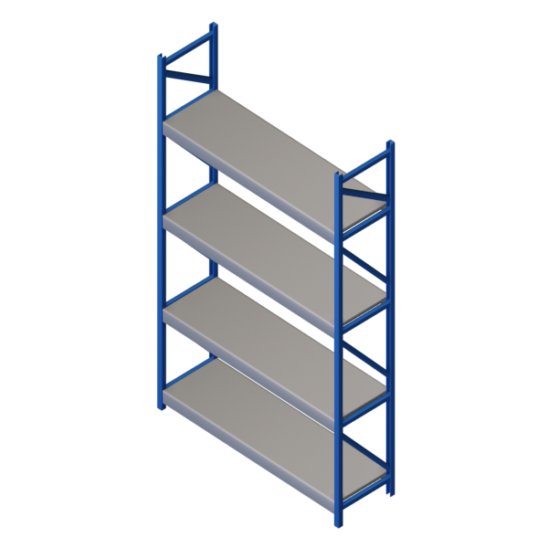

与Rack逻辑基本一致，只是模型和样式发生了改变。参数建模。

### 2.4.3 WMS 
 

#### 基础属性
- 容量 Capacity（int）
- 原始类型 OriginType（String）
- 下一个处理的对象集合 NextObject（List）
- 在哪个对象上 Location（Object）
- 正在服务的对象 Cont（Object）
- 正在服务的对象集合 ContList（List）
- 旋转角度 Angle（double）
#### 故障特性
- 是否开启故障 FailureActive（boolean）
#### 统计
- 正在处理的对象数量 NumEntity（int）
- 正在处理的对象数量 NumEntityParts（int）
- 累计进入的对象数量 StatsNumIn（long）
- 累计离开的对象数量 StatsNumOut（long）
#### 基础逻辑
- 入口控制方法 InCtrl（String）
- 出口控制方法 OutCtrl（String）

## 2.5 AGV系统
主要用于定义AGV搬运小车的工作系统。

### 2.5.1 Point 

AGV路径点。
#### 基础属性
- 点类型 Type（String）：取值：路/泊车点。
- 前序路线 FrontPath（List）：一个节点可能有多个前序路线。
- 后序路线 EndPath（List）：后序路线。
#### 统计
- 流量 Flow（int）：该点位总共有多少次小车经过。

### 2.5.2 Path 

AGV路径。
#### 基础属性
- 双向通路 TwoWay（boolean）：是否为两个方向都可以通行。
- 起始点 FrontPoint（Object）：路径的起点。
- 终止点 EndPoint（Object）：路径的终点。
- 长度 Length（double）。
#### 统计
- 流量 Flow（int）：该路线总共有多少次小车经过。

#### 2.5.3 简单路径图搭建
我们有一个巷道式的仓库，如图所示。

首先我们可以看到图中的节点数量为10个，把这10个节点拖入场景中。

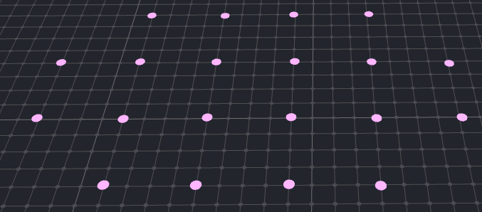

然后点击编辑器顶部的「path」模式，如图所示将之间有路径的路径点用path连接起来。

在编辑器左下方可以看到生成的path。
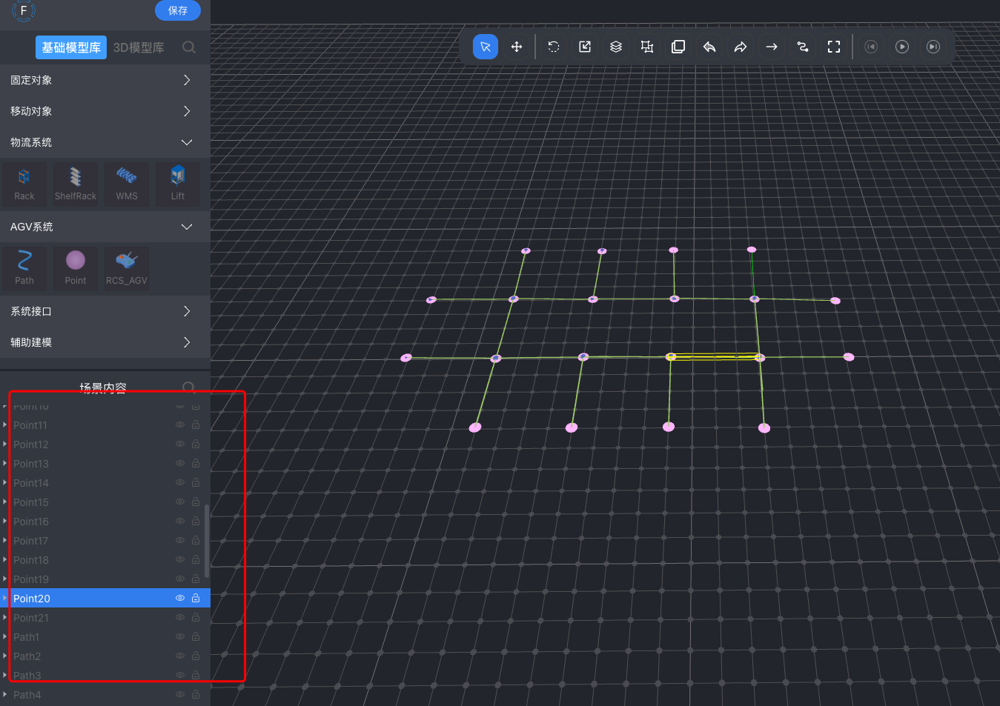
点击这些path，可以看到，起始点、终止点以及长度属性已经自动生成，可以在此基础上微调，并且由于是巷道仓库，这些路径都是双向的，所以要确保双向通路这个开关也是打开的。
这样，我们的简单AGV途径图就搭建完毕了！

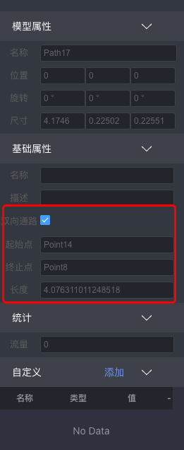

### 2.5.4 RCS_AGV 

#### 基础属性
- 任务调度策略 TaskStragety（String）：取值：按顺序执行/按优先级执行。
- AGV调度策略 AgvStragety（String）：取值：最空闲。
